+++
title = "HackTheBox Business CTF Cyber Skills Benchmart 2025: Operation Blackout Write Up"
date = "2025-05-24"
aliases = ["ctf"]
author = "Fidelya Fredelina"
toc = true
+++

## Cloud

### [Easy] Vault

Vault is a vulnerable S3 bucket challenge with a twist. We're given a static website hosted on S3 with a few public files that can be downloaded.

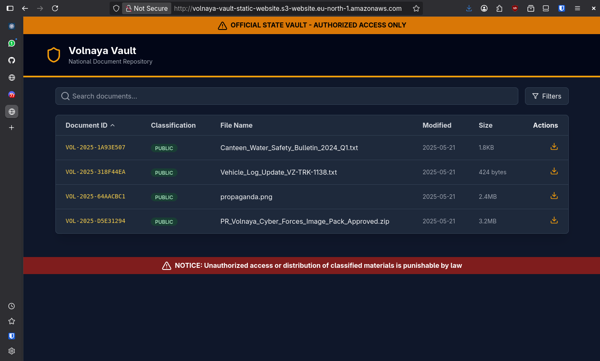

If we try to download one of the files, we can see that it gives or responds to us a link to another S3 bucket specifically used to store files.

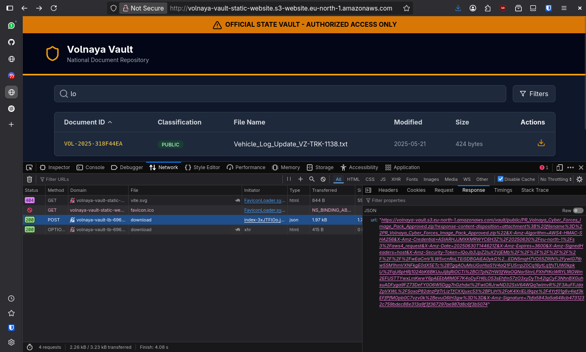

Upon further inspection using the `aws cli` client, we've found the complete directory of this `volnaya-vault` bucket. It has public and private subfolders.

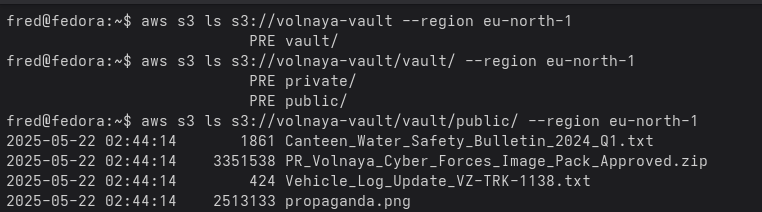

But if we try to download (a.k.a copy the file to our local machine) the files using the copy command like we usually would do, we'll get a 403 Forbidden error. So how can the static website download the file we requested for us before?

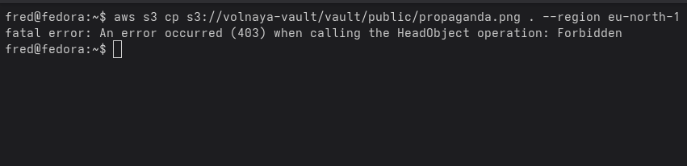

If we trace the request made by the static web when we clicked download, rather than making a direct connection to the vault S3 bucket, it calls on an API endpoint `/api/download`. It made a POST request with the body specifying which file we want to request from the vault bucket. 

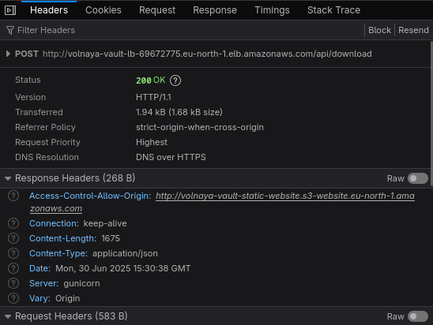 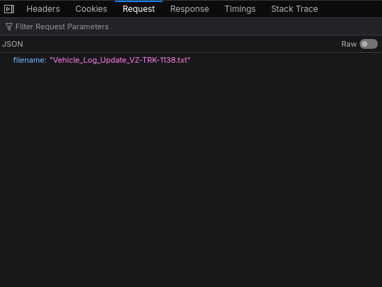

Using curl to test this endpoint, we get the following respond, the same one we got from interacting with the static website. 

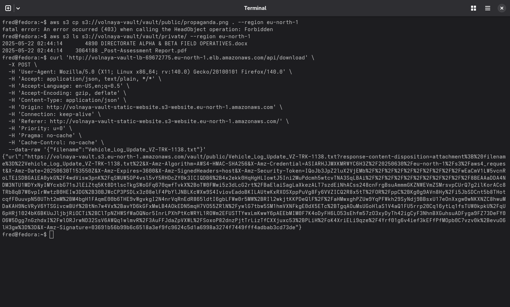

Since we have direct control of which file we want to request through the POST request body, can we force it to traverse to the private subfolder instead? Turns out you can! And we'll get a valid download link for one of the private files which has our flag.

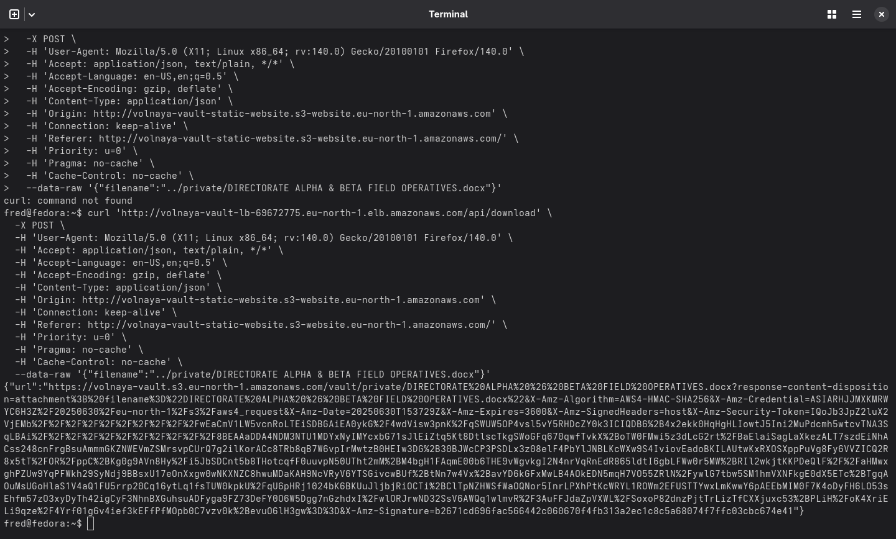

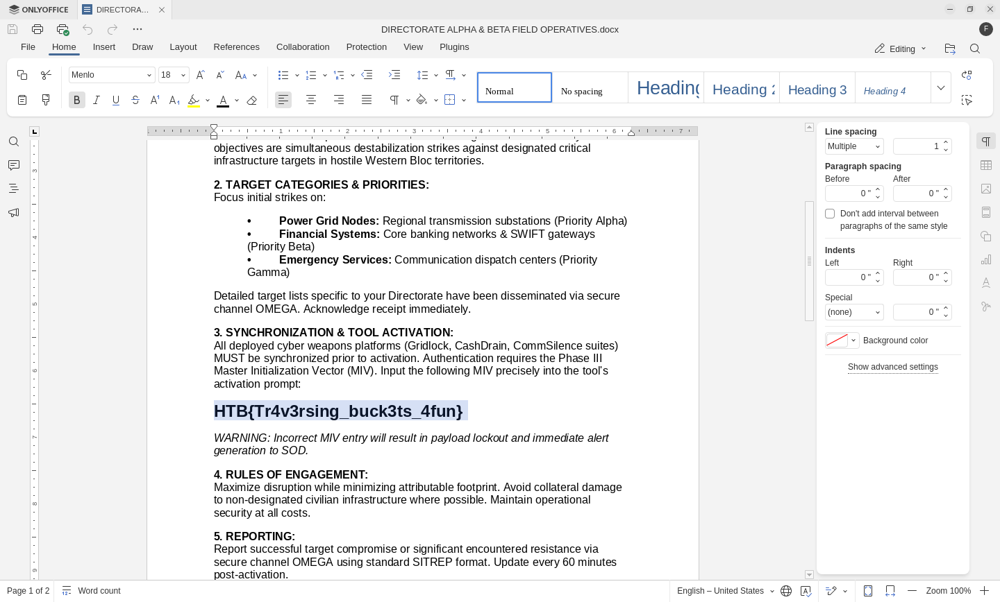

### [Medium] EBS

EBS is a vulnerable AWS Cognito default sign up web app. To access the Emergency Broadcast System, we have to sign in first using AWS Cognito. Inspecting the Network tab to see the requests made by the web app will reveal a cognito signup link with a lot of restrictions. 

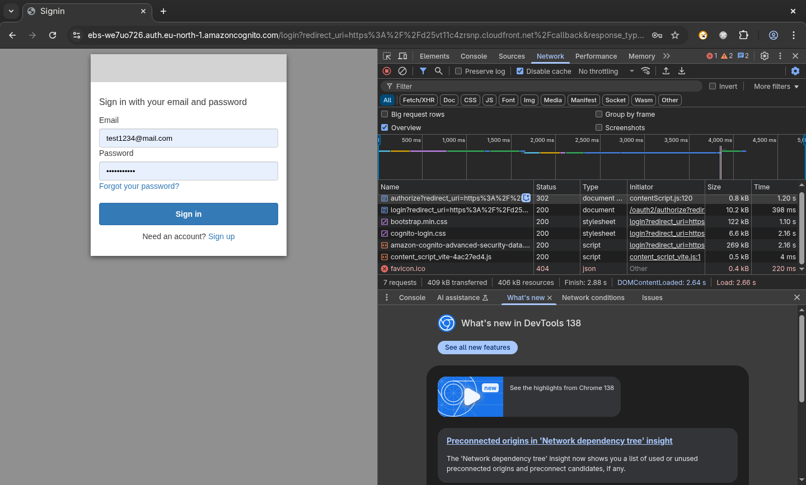

The link exposes the identity pool but it also gives us a scope for our ID so when we do log in with this account and retrieve our AWS key and secret, there's not much we can do. 

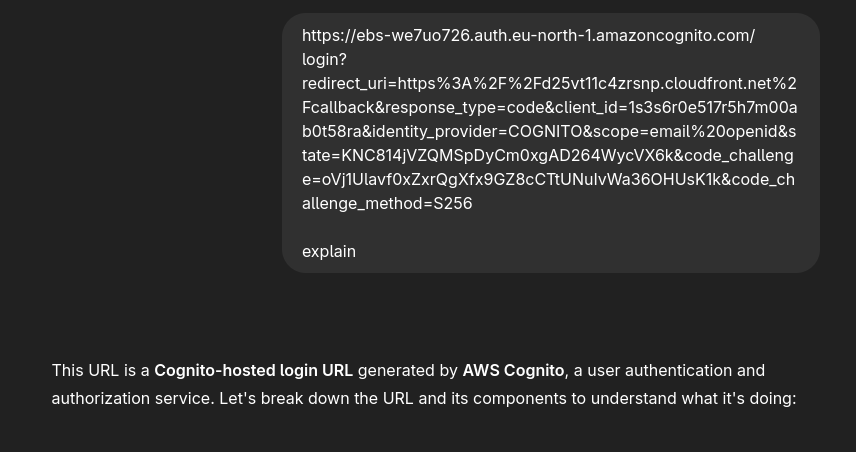

However, I found this step to be necessary because looking at the Network tab again, we can see an interesting `config.json` file being retrieved that exposes even more information about this Cognito deployment. This file is interesting because these are the needed information to exploit the default sign up vulnerability, where you are allowed to *bypass* the restrictions put by the EBS web app by *simply signing up directly to the Cognito deployment*. This exploit requires the client ID, identity pool, identity pool ID (to get the AWS credentials), and the region (VERY important!)

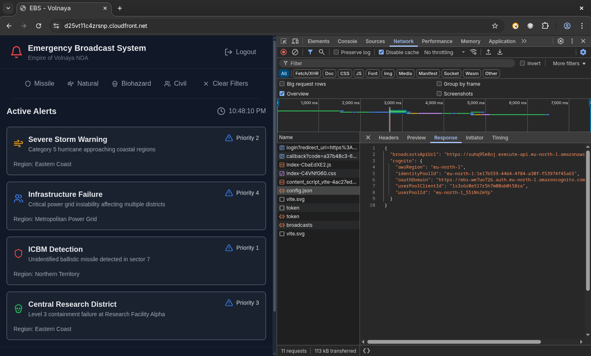

I use [cognito-scanner](https://github.com/padok-team/cognito-scanner) to do the default signup exploit by giving the parameters I mentioned before. This GitHub project gives more information and context about the 3 parameters needed for this exploit to work. The result is a temporary AWS credential that has more privilege than the one we made through the "normal sign up process".

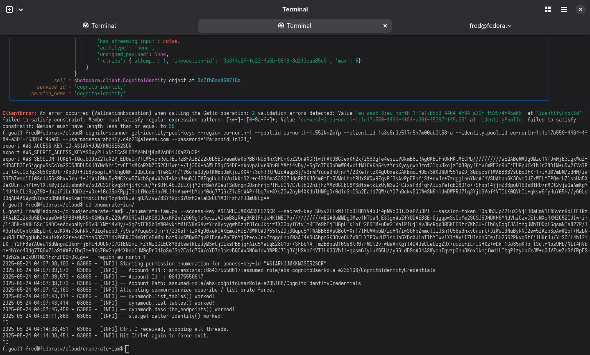

After saving the credentials to a new profile on my aws configuration file, I run [enumerate-iam](https://github.com/andresriancho/enumerate-iam) to enumerate for potential sensitive AWS services tied to this privileged role. And I happened to find that the role has permissions to list and read Dynamo DB tables and all of their contents!

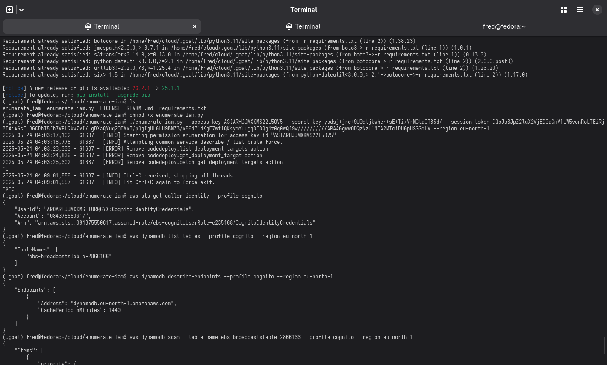

Found the flag that way.

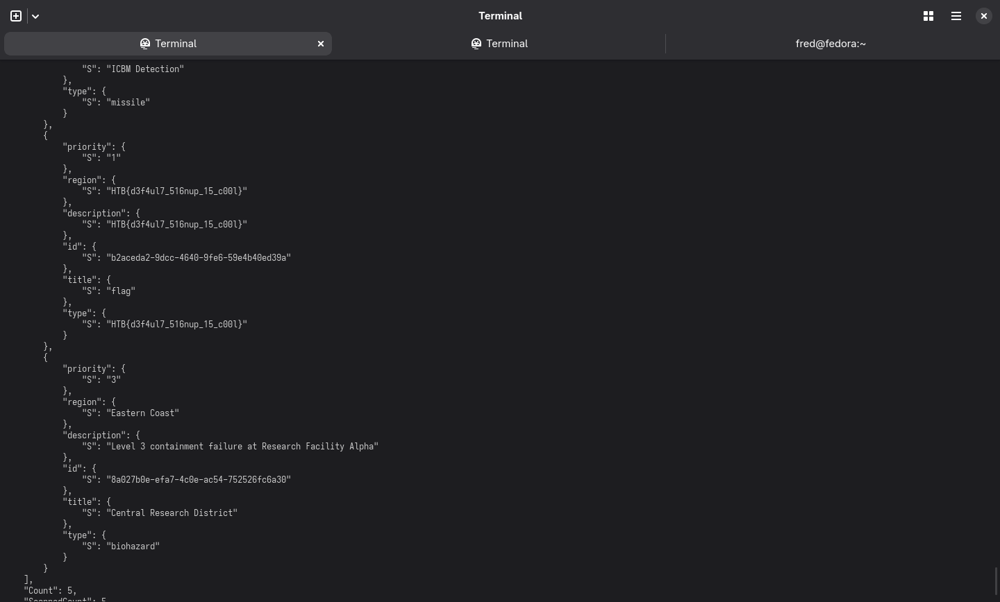