+++
title = "SMT Program 2025: Various Write Up"
date = "2025-08-14"
aliases = ["ctf"]
author = "Fidelya Fredelina"
toc = true
+++

I have so many things I want to say about this program and how it affected me down the line but I want to keep this section professional, so here are the write ups:

## Malware

### Static

Description

```
Before you start analyzing a malware file, it is generally a good practice to take its hash and search it on VirusTotal to see if others have analyzed the same file before. For this challenge, we give you this SHA256 hash: `556700ac50ffa845e5de853498242ee5abb288eb5b8ae1ae12bfdb5746e3b7b1`.

Answer the questions at `nc 52.77.77.117 10031`
```

This is an easy/baby challenge to introduce you about how to use VirusTotal as a first stop for malware analysis. Visiting VirusTotal to look for the hash of the file will return the ILOVEYOU worm report.

Connecting to the IP address, you will be facing a usual forensics type of challenge where you need to answer multiple questions to get the flag.

```
fred@fedora:~$ nc 52.77.77.117 10031
===================
  static analysis  
===================

1. What type of malware is it mainly attributed as? (e.g. trojan)
>>> worm
Correct! Next...

2. What is the file type of the malware? (e.g. apk)
>>> vba
Correct! Next...

3. When is the first time the malware was submitted to VirusTotal? (e.g. 2020-12-31)
>>> 2016-06-11
Correct! Next...

4. According to the "behavior" section, the malware was executed using a Windows executable. What is the name of the executable? (e.g. powershell.exe)
>>> wscript.exe
Correct! Next...

Congrats! 4 out of 4 answers correct!

Flag: SMT2025{us3_v1rus_t0t4l_4_1niti4l_4nalys1s}
```

### Macro 1

Description

```
Why does the file extension ends in `m`? I thought it's supposed to be `xlsx`?

ZIP file password: SMT2025
```

The ZIP file contains an Excel file that has Macro embedded in it. You don't need Microsoft Office to open the file or the macro. This is me showing the macro file to analyze using LibreOffice:

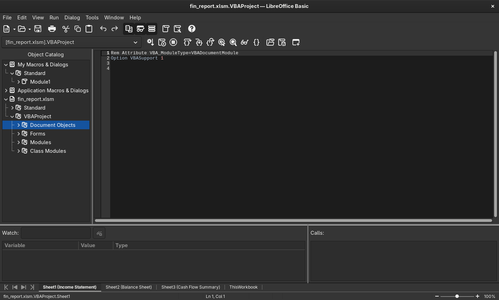

Going through the macro will return this flag:

```
Rem Attribute VBA_ModuleType=VBADocumentModule
Option VBASupport 1
Private Sub Workbook_Open()
    Dim secretMessage As String
    secretMessage = "SMT2025{m4cr0s_4r3_c00l}"
    MsgBox "You've been hacked"
End Sub
```

You can also use olevba to analyze the macro.

### Macro 2

Description

```
Okay, the last macro was nothing. This time, I've devised a more complex one! Only the computer can understand it!

ZIP file password: SMT2025
```

We are given another Excel file with macros embedded as well. However, this time the macro file is more complicated and requires simple reverse engineering. The interesting macro looks like this:

```
Rem Attribute VBA_ModuleType=VBADocumentModule
Option VBASupport 1
Private Declare PtrSafe Function CreateThread Lib "kernel32" (ByVal SecurityAttributes As Long, ByVal StackSize As Long, ByVal StartFunction As LongPtr, ThreadParameter As LongPtr, ByVal CreateFlags As Long, ByRef ThreadId As Long) As LongPtr
Private Declare PtrSafe Function VirtualAlloc Lib "kernel32" (ByVal lpAddress As LongPtr, ByVal dwSize As Long, ByVal flAllocationType As Long, ByVal flProtect As Long) As LongPtr
Private Declare PtrSafe Function RtlMoveMemory Lib "kernel32" (ByVal lDestination As LongPtr, ByRef sSource As Any, ByVal lLength As Long) As LongPtr
Private Declare PtrSafe Function WaitForSingleObject Lib "kernel32" (ByVal hHandle As LongPtr, ByVal dwMilliseconds As Long) As Long
Private Declare PtrSafe Function GetExitCodeThread Lib "kernel32" (ByVal hThread As LongPtr, lpExitCode As Long) As Long

Sub FlagChecker()
    Dim shellcode As Variant
    Dim userInput As String
    Dim addrShellcode As LongPtr
    Dim addrInput As LongPtr
    Dim counter As Long
    Dim data As Long
    Dim res As Long
    Dim ThreadId As Long
    Dim hThread As LongPtr
    Dim exitCode As Long

    shellcode = Array(49, 192, 128, 57, 83, 117, 110, 128, 121, 1, 77, 117, 104, 128, 121, 2, 84, 117, 98, 128, 121, 3, 50, 117, 92, 128, 121, 4, 48, 117, 86, 128, 121, 5, 50, 117, 80, 128, 121, 6, 53, 117, 74, 128, 121, 7, 123, 117, 68, 128, 121, 8, 121, 117, 62, 128, 121, 9, 48, 117, 56, 128, 121, 10, 117, 117, 50, 128, 121, 11, 95, 117, 44, 128, 121, 12, 103, 117, 38, 128, 121, 13, 48, 117, 32, 128, 121, 14, 116, 117, 26, 128, 121, 15, 95, 117, 20, 128, 121, 16, 109, 117, 14, 128, 121, 17, 51, 117, 8, 128, 121, 18, 125, 117, 2, 176, 1, 195)

    userInput = InputBox("Welcome! To access the secret, you must enter the flag:", "Flag Check")

    addrShellcode = VirtualAlloc(0, UBound(shellcode) + 1, &H3000, &H40)

    For counter = LBound(shellcode) To UBound(shellcode)
        data = shellcode(counter)
        RtlMoveMemory ByVal (addrShellcode + counter), data, 1
    Next counter

    addrInput = VirtualAlloc(0, 19, &H3000, &H40)

    For counter = 0 To Len(userInput) - 1
        data = Asc(Mid(userInput, counter + 1, 1))
        RtlMoveMemory ByVal (addrInput + counter), data, 1
    Next counter

    hThread = CreateThread(0, 0, addrShellcode, addrInput, 0, ThreadId)

    WaitForSingleObject hThread, &HFFFFFFFF

    GetExitCodeThread hThread, exitCode

    If exitCode = 1 Then
        MsgBox "Correct Flag!", vbInformation
    Else
        MsgBox "Incorrect Flag!", vbExclamation
    End If
End Sub

Private Sub Workbook_Open()
    FlagChecker
End Sub
```

Even without prior knowledge of macro scripting, it's clear that the macro is asking for a flag item to be compared using the hardcoded shellcode. Shellcodes are just raw bytes representation of assembly instructions. So, to know how the flag comparison works, we need to decode the shellcode array into its appropriate assembly representation. Using this python script to make a bin file of the shellcode:

```
bytes_array = [
    49, 192, 128, 57, 83, 117, 110, 128, 121, 1, 77, 117, 104, 128, 121, 2, 84, 117, 98, 128, 121, 3, 50, 117, 92, 128, 121, 4, 48, 117, 86, 128, 121, 5, 50, 117, 80, 128, 121, 6, 53, 117, 74, 128, 121, 7, 123, 117, 68, 128, 121, 8, 121, 117, 62, 128, 121, 9, 48, 117, 56, 128, 121, 10, 117, 117, 50, 128, 121, 11, 95, 117, 44, 128, 121, 12, 103, 117, 38, 128, 121, 13, 48, 117, 32, 128, 121, 14, 116, 117, 26, 128, 121, 15, 95, 117, 20, 128, 121, 16, 109, 117, 14, 128, 121, 17, 51, 117, 8, 128, 121, 18, 125, 117, 2, 176, 1, 195
]


with open("shellcode.bin", "wb") as f:
    f.write(bytes(bytes_array))
```

And using `ndisasm` to disassemble the binary will return:

```
00000000  31C0              xor eax,eax
00000002  803953            cmp byte [ecx],0x53
00000005  756E              jnz 0x75
00000007  8079014D          cmp byte [ecx+0x1],0x4d
0000000B  7568              jnz 0x75
0000000D  80790254          cmp byte [ecx+0x2],0x54
00000011  7562              jnz 0x75
00000013  80790332          cmp byte [ecx+0x3],0x32
00000017  755C              jnz 0x75
00000019  80790430          cmp byte [ecx+0x4],0x30
0000001D  7556              jnz 0x75
0000001F  80790532          cmp byte [ecx+0x5],0x32
00000023  7550              jnz 0x75
00000025  80790635          cmp byte [ecx+0x6],0x35
00000029  754A              jnz 0x75
0000002B  8079077B          cmp byte [ecx+0x7],0x7b
0000002F  7544              jnz 0x75
00000031  80790879          cmp byte [ecx+0x8],0x79
00000035  753E              jnz 0x75
00000037  80790930          cmp byte [ecx+0x9],0x30
0000003B  7538              jnz 0x75
0000003D  80790A75          cmp byte [ecx+0xa],0x75
00000041  7532              jnz 0x75
00000043  80790B5F          cmp byte [ecx+0xb],0x5f
00000047  752C              jnz 0x75
00000049  80790C67          cmp byte [ecx+0xc],0x67
0000004D  7526              jnz 0x75
0000004F  80790D30          cmp byte [ecx+0xd],0x30
00000053  7520              jnz 0x75
00000055  80790E74          cmp byte [ecx+0xe],0x74
00000059  751A              jnz 0x75
0000005B  80790F5F          cmp byte [ecx+0xf],0x5f
0000005F  7514              jnz 0x75
00000061  8079106D          cmp byte [ecx+0x10],0x6d
00000065  750E              jnz 0x75
00000067  80791133          cmp byte [ecx+0x11],0x33
0000006B  7508              jnz 0x75
0000006D  8079127D          cmp byte [ecx+0x12],0x7d
00000071  7502              jnz 0x75
00000073  B001              mov al,0x1
00000075  C3                ret
```

The assembly uses a lot of `compare` instructions to compare the input from the user with the actual flag. Decoding the bytes that is used to compare the input will return the flag:

```
SMT2025{y0u_g0t_m3}
```

### Strange PDF

Description

```
I visited a URL to get free ROBUX, but it gave me a PDF instead? Now I'm afraid because when I open the PDF on a browser, it says ""You are hacked!"".

Note: the PDF file is harmless and safe to open.
```

Was given a pcap file where I could extract a suspicious pdf:

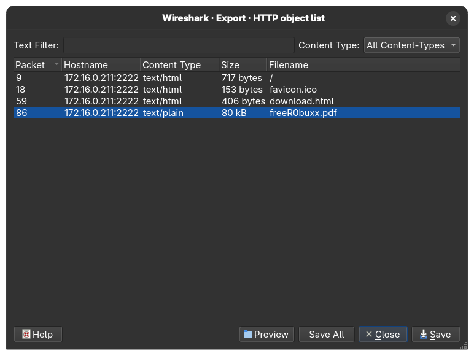

The challenge description (and hint) hinted that the pdf file contain a Javascript code. Running it on a browser (not recommended) will give you the alert "you are hacked", just like what's said in the description. Using a safer and more effective tool like pdf-parser, we can detect the Javascript object:

```
fred@fedora:~$ pdf-parser --search  freeR0buxx.pdf 
This program has not been tested with this version of Python (3.13.3)
Should you encounter problems, please use Python version 3.12.2
obj 1 0
 Type: /Catalog
 Referencing: 3 0 R, 3 0 R, 4 0 R, 5 0 R

  <<
    /Lang (en_GB)
    /MarkInfo
      <<
        /Marked true
        /Type /MarkInfo
      >>
    /Names
      <<
        /JavaScript
          <<
            /Names
              <<
                /JS 3 0 R
                /S /JavaScript
              >>
            ]
          >>
      >>
    /OpenAction
      <<
        /JS 3 0 R
        /S /JavaScript
      >>
    /Pages 4 0 R
    /StructTreeRoot 5 0 R
    /Type /Catalog
    /ViewerPreferences
      <<
        /DisplayDocTitle true
        /Type /ViewerPreferences
      >>
  >>
```

There is one Javascript object (JS 3 0 R) that can be analyzed further with:

```
fred@fedora:~$ pdf-parser freeR0buxx.pdf --object 3 --raw
This program has not been tested with this version of Python (3.13.3)
Should you encounter problems, please use Python version 3.12.2
obj 3 0
 Type: 
 Referencing: 
 Contains stream

  <<
    /Length 715
    /Filter /FlateDecode
  >>
```

Seems like the object is filtered/decoded or not in a raw form. So, let's use the --filter option to analyze it even further:

```
 b"const _0x35af3f=_0x38dc;(function(_0x79f814,_0x52d802){const _0x107e33=_0x38dc,_0x40247f=_0x79f814();while(!![]){try{const _0x2c9e4e=-parseInt(_0x107e33(0x1e4))/0x1*(parseInt(_0x107e33(0x1ed))/0x2)+parseInt(_0x107e33(0x1ec))/0x3+parseInt(_0x107e33(0x1eb))/0x4+-parseInt(_0x107e33(0x1f0))/0x5*(parseInt(_0x107e33(0x1e6))/0x6)+-parseInt(_0x107e33(0x1ee))/0x7*(parseInt(_0x107e33(0x1e3))/0x8)+-parseInt(_0x107e33(0x1ef))/0x9*(-parseInt(_0x107e33(0x1ea))/0xa)+-parseInt(_0x107e33(0x1e9))/0xb;if(_0x2c9e4e===_0x52d802)break;else _0x40247f['push'](_0x40247f['shift']());}catch(_0x53d799){_0x40247f['push'](_0x40247f['shift']());}}}(_0x425d,0x282ee),app[_0x35af3f(0x1e5)](_0x35af3f(0x1e2)));const secretCodes=[0x53,0x4c,0x56,0x31,0x34,0x37,0x33,0x7c,0x7a,0x39,0x68,0x7e,0x74,0x52,0x69,0x3f,0x7e,0x22,0x4d,0x61,0x24,0x77,0x7a,0x27,0x60,0x46,0x2e,0x78,0x7f,0x2d,0x6b,0x71,0x54,0x7e,0x16,0x4f,0x11,0x4a,0x79,0x40,0x18,0x47,0x19,0x56];let res_string='';function _0x425d(){const _0x5e00bb=['98WMXaGj','14hdAIoV','63vplRra','7475BnkArh','you are hacked lol','15352DpCPAf','5671bukCjs','alert','414tTEYYo','fromCharCode','length','2470809jgIBmC','274390qpkmeC','1097232WLgqcA','923100FinnSJ'];_0x425d=function(){return _0x5e00bb;};return _0x425d();}function _0x38dc(_0x4b04be,_0x45a38d){const _0x425d36=_0x425d();return _0x38dc=function(_0x38dcc5,_0x16d34d){_0x38dcc5=_0x38dcc5-0x1e2;let _0x29ff77=_0x425d36[_0x38dcc5];return _0x29ff77;},_0x38dc(_0x4b04be,_0x45a38d);}for(let i=0x0;i<secretCodes[_0x35af3f(0x1e8)];i++){const xored=secretCodes[i]^i,res_char=String[_0x35af3f(0x1e7)](xored);res_string+=res_char;}"
```

This is definitely an obfuscated Javascript code, using online JS de-obfuscater will return this code:

```
const secretCodes = [0x53, 0x4c, 0x56, 0x31, 0x34, 0x37, 0x33, 0x7c, 0x7a, 0x39, 0x68, 0x7e, 0x74, 0x52, 0x69, 0x3f, 0x7e, 0x22, 0x4d, 0x61, 0x24, 0x77, 0x7a, 0x27, 0x60, 0x46, 0x2e, 0x78, 0x7f, 0x2d, 0x6b, 0x71, 0x54, 0x7e, 0x16, 0x4f, 0x11, 0x4a, 0x79, 0x40, 0x18, 0x47, 0x19, 0x56];
let res_string = '';
for (let i = 0x0; i < secretCodes.length; i++) {
  const xored = secretCodes[i] ^ i;
  const res_char = String.fromCharCode(xored);
  res_string += res_char;
}
```

The code turns out to be a mechanism to reveal the secret code (possibly the flag) by using XOR mechanism. I added the console.log() part to print the XOR-ed secret code and running the de-obfuscated code will return the flag:

```
fred@fedora:~/Documents/SMT $ node test.js
SMT2025{r0bux_g0n3_r0bl0x_4cc0unt_4l5o_g0n3}
```

## Crypto

### welcome
Description
``` 
This message has been... encoded? encrypted? Whatever that is... Anyways, can you read it?

UkxTMjAyNXt2M2tibmwzX3MwX3NnM19icXhvczBfdjBxa2MhfQ==
```

The double equal signs at the end of the string highly suggest that it's a base64 encoded flag. Decoding the base64 will still return gibberish:

```
RLS2025{v3kbnl3_s0_sg3_bqxos0_v0qkc!}
```

But we know the flag starts with the usual 'SMT2025' string, so RLS2025 is just a shifted version of the flag (shifted 1 bit to the right). Decrypting that will return:

```
SMT2025{w3lcom3_t0_th3_crypt0_w0rld!}
```

### eAESy

Description
```
This is a basic implementation of AES. Can you decrypt the message?
```

The source code given to us is this:

```
import os
from Crypto.Cipher import AES					# pip install pycryptodome
from Crypto.Util.Padding import pad, unpad

FLAG = b'SMT2025{REDACTED}'
key = b'smt_progr4m_2k25'

# Function to encrypt the flag
def encrypt(msg, key):
	iv = os.urandom(AES.block_size)
	cipher = AES.new(key, AES.MODE_CBC, iv)
	ciphertext = cipher.encrypt(pad(msg, AES.block_size))	# AES block size is 16 bytes
	return (iv + ciphertext).hex()

# Write the encryption result to flag.enc
with open("flag.enc", "w") as f:
	f.write(encrypt(FLAG, key))

# Encrypted FLAG (from flag.enc): 4abd733e0662e1b1aa3d1996f789209b5c9684941f1717d05000e861cab8491bef153fffd9feb7502ba96144d061517a134456204eb06d250f5266e0e9945c76
```

We have a CBC mode AES encryption mechanism. CBC is a mode in block cipher where the plaintext is divided into an equal sized block, then it'll be encrypted through XOR-ing the output of the last block with the current block's input before the last XOR operation with the actual key. This helps obfuscate patterns in block ciphers so that the encryption process will return random data even if it's encrypted using the same key. When the plaintext can't be neatly divided into the determined block size, padding will be added at the end of the plaintext. Decryption then works the same way but on reverse. 

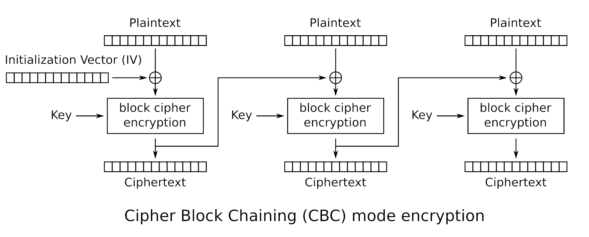

But what happens to the first block's plaintext? If the encryption and decryption method depends on the previous block, then what will be used to encrypt the first block's plaintext? This is where IV (initialization vector) comes in. 

Therefore, in order to decrypt this flag, we need to reverse the `encrypt` method into `decrypt` by supplying the initialization vector. We also need to unpad the encoded flag to get rid of unneeded data at the end of it. But where's the IV? If we look at this line of code:

```
return (iv + ciphertext).hex()
```

The flag is in hexadecimal encoding where the iv is appended before the ciphertext. Okay, we know where it is, but how big is the size of the IV before it transitions into the actual flag? From this code:

```
iv = os.urandom(AES.block_size)
```

And by looking at the documentation of the `os.urandom` functionality:

```
Syntax: os.urandom(size)

Parameter: 
size: It is the size of string random bytes

Return Value:  This method returns a string which represents random bytes suitable for cryptographic use.
```

We can conclude that the IV's size is as big as AES's default block size, which is 16 bytes according to the documentation:

```
AES (Advanced Encryption Standard) is a symmetric block cipher standardized by NIST . It has a fixed data block size of 16 bytes. Its keys can be 128, 192, or 256 bits long.
```

With this, we're ready to construct our decoding script which is:

```
from Crypto.Cipher import AES
from Crypto.Util.Padding import unpad

key = b'smt_progr4m_2k25'

with open("flag.enc", "r") as f:
    data = bytes.fromhex(f.read())

iv = data[:16]               # First 16 bytes is the IV
ciphertext = data[16:]      # The rest is ciphertext

cipher = AES.new(key, AES.MODE_CBC, iv)
plaintext = unpad(cipher.decrypt(ciphertext), AES.block_size)

print(plaintext.decode())

# output: SMT2025{3ncrypt1on_4nd_d3crypt1on}
```

### rsaaaaaaaaaa

Description
```
In RSA, the security lies on the fact that N is hard to factorize. What if it isn't?
```

We're given this output:
```
N = 41874700861388258853489749809278828485531955632713300130620929705146462431987
e = 65537
c = 6459193742574944020759123901642766353850952579897308947159707555151928327695
```

And this script that generates it:

```
from Crypto.Util.number import getPrime, bytes_to_long, long_to_bytes	# pip install pycryptodome

FLAG = b"SMT2025{REDACTED}"

# RSA Parameters
p = getPrime(128)
q = getPrime(128) 
N = p*q
e = 65537
phi = (p-1)*(q-1)
d = pow(e,-1,phi)

# Encrypting the flag
c = pow(bytes_to_long(FLAG),e,N)

# Print only the public parameters
print(f"N = {N}")
print(f"e = {e}")
print(f"c = {c}")
```

At first, I thought the problem was e's value being too small but turns out the problem lies on the comically small size of p and q. 128 bits of p and q is apparently too small, and someone probably has tried calling the `getPrime() ` method a lot of times and putting the outputs inside a database. Wait, that's factordb! I used a CLI tool called RsaCtfTool (available on Kali Linux) to automatically find the factors of N and then decrypt the message:

```
(.crypto) 📦[fred@kalilinux rsaaaaaaaaa]$ RsaCtfTool -n 41874700861388258853489749809278828485531955632713300130620929705146462431987 -e 65537 --decrypt 6459193742574944020759123901642766353850952579897308947159707555151928327695
private argument is not set, the private key will not be displayed, even if recovered.
['/tmp/tmp9amk4o0y']

[*] Testing key /tmp/tmp9amk4o0y.
attack initialized...
attack initialized...
[*] Performing factordb attack on /tmp/tmp9amk4o0y.
[*] Attack success with factordb method !

Results for /tmp/tmp9amk4o0y:

Decrypted data :
HEX : 0x0000000000000000534d54323032357b736d346c6c5f7072316d335f6234647d
INT (big endian) : 2042560714541759777531017945383753117713705496608779822205
INT (little endian) : 56716152322296766827953118673252260675642938335221680111187167816688116695040
utf-8 : SMT2025{sm4ll_pr1m3_b4d}
utf-16 : 䵓㉔㈰笵浳水彬牰洱弳㑢絤
STR : b'\x00\x00\x00\x00\x00\x00\x00\x00SMT2025{sm4ll_pr1m3_b4d}'
(.crypto) 📦[fred@kalilinux rsaaaaaaaaa]$ 
```

TL;DR don't use a comically small prime, someone's probably uploaded that to factordb.

### birthday

Description
```
There are 366 possible birthdays in a year, yet only 23 people are needed for the chance of a shared birthday to exceed 50%.

There are 2^32 possibly generated hash from this hash algorithm, yet only [???] generated hash are needed for the chance of a collision to exceed 50%.

Can you find the collision?

Connect using `nc 52.77.77.117 10041`
```

This is a challenge to find a hash collision. How do I know this? From the description and also, the source code of the server:

```
#!/usr/bin/env python3

import hashlib
from secret import FLAG

# Hash algorithm
# 4-byte / 32-bit hash --> 2^32 possible hash values
def custom_hash(string):
    mini_md5 = hashlib.md5(string.encode()).digest()[:4].hex()
    return mini_md5

# Main code

print("\033[1mHappy birthday!\033[0m 🥳🎉🎉")
print("If you give me two different strings that have the same hash value, I will give you the \033[1mFLAG\033[0m.")
print("There's one little catch, however: " + 'both strings have to start with \033[1m"SMT"\033[0m :)')

str1 = input("String 1: ")
str2 = input("String 2: ")

try:
    if str1 == str2:
        print("❌ You have to input two different strings!")

    else:
        if str1[:3] == "SMT" and str2[:3] == "SMT":
            hash1 = custom_hash(str1)
            hash2 = custom_hash(str2)
            print(f"(Hash) String 1: {hash1}")
            print(f"(Hash) String 2: {hash2}")
            if hash1 == hash2:
                print(f"✅ Same hash... Congratulations! You deserve a flag: \033[93m{FLAG.decode()}\033[0m")
            else:
                print(f"❌ Different hash... Try again!")
        else:
            print('❌ Remember, both strings have to start with "SMT"!')

except Exception as e:
    print(f"⚠️ Error: {e}")
```

We're only given the flag when the server computes the same hash from 2 different inputs with the prefix SMT. But how can we find a hash collision? Aren't commonly used hash algorithms supposed to be resistant against collision attacks?

Take a look at the custom hash function. It's using md5 (considered obselete now because a collision has happened before) AND it's trimming that to only a 4 byte/32 bits hash function. This might seem like a challenging task, to bruteforce for 2 inputs (with the SMT prefix) that has the same hash. But modern computers can do millions of calulcations in just seconds. This is my bruteforcing script:

```
def custom_hash(s):
    return hashlib.md5(s.encode()).digest()[:4].hex()

def generate_smt_string(length=8):
    suffix = ''.join(random.choices(string.ascii_letters + string.digits, k=length))
    return "SMT" + suffix

def find_collision():
    seen = {}
    attempts = 0
    while True:
        s = generate_smt_string()
        h = custom_hash(s)
        attempts += 1

        if h in seen and seen[h] != s:
            print(f"Collision found after {attempts} attempts.")
            print(f"String 1: {seen[h]}")
            print(f"String 2: {s}")
            return seen[h], s
        seen[h] = s
```

First, we defined the custom hash function. Second, we try to generate a bunch of SMTxxyyzzz strings using a combination of ascii letters, digits, and with length 8 (randomly picked). There's a higher chance of collision happening if we use a mix of letters and digits. The final and most important step is to iterate through the generation process, putting that inside a dictionary, and only stopping when we found a match.

A match here is described here:
```
if h in seen and seen[h] != s
```
So, if the computed hash *h* at increment *i* has already been inputted inside the dictionary *seen* but the corresponding input string *seen[h]* does NOT equal to the currently generated string *s* at increment *i* (i hope this makes sense...), consider that a collision and return both strings.

Running the script against the server will return this:

```
fred@fedora:~/crypt$ python3 bday.py
Collision found after 128438 attempts.
String 1: SMT65mde431
String 2: SMTEE40wvDL
📩 Server says:
 Happy birthday! 🥳🎉🎉
If you give me two different strings that have the same hash value, I will give you the FLAG.
There's one little catch, however: both strings have to start with "SMT" :)
String 1: 
🎉 Final response:
 String 2: (Hash) String 1: 16c13228
(Hash) String 2: 16c13228
✅ Same hash... Congratulations! You deserve a flag: SMT2025{saengil_chukha_hamnida}
```

This script runs almost on a instant for me.

## OS

### Out of Sight

Description:

```
Welcome to our very first OS challenge.
Somewhere on this system lies a flag... but not everything is visible at first glance.

Can you find it? I know you can, let's find it!
Connect here: nc 52.77.77.117 9040
```

Connecting to the remote address and listing the files return a readme.txt that gives a hint about ls capabilities:

```
fred@fedora:~$ nc 52.77.77.117 9040
-sh: 0: can't access tty; job control turned off
$ ls
ls
readme.txt
$ cat readme.txt
cat readme.txt
Nothing interesting here! ls has many options. One of them is worth to try, buddy :)
$ 
```

ls does have many options, one of them listing hidden files. I've used this before many times for my own shenanigans but anyways, doing that will return a list of hidden files:

```
ls -a
.  ..  .bash_logout  .bashrc  .flag.txt  .profile  readme.txt
```

Well there you go, the flag is marked as a hidden file. However, you can still print the content of a hidden file using the cat command as always.

```
$ cat .flag.txt
cat .flag.txt
SMT2025{hidden_permission_flag}
```

### Random Cities

```
Your objective exists among executables.

Connect here: nc 52.77.77.117 8087
```

Upon connecting, listing the files of current directory return an executable and some text files.

```
=====================================
         Welcome to Cities!
=====================================

Look for the flags through the executables!
'Be careful who you trust Sergeant' -Ghost

ctf@1fee2ffd73bd:~$ ls
ls
README.md  cities  cities.txt  notes.txt
ctf@1fee2ffd73bd:~$ 
```

I thought the solution was to run the executable or modifying its permission bit to get the flag I wanted. However, doing both will result in nothing since the binary can't be executed due to some errors, and the regular ctf user doesn't have the rights to grant file permission. 

Unlocking the hint makes the solution obvious, however.

```
This challenge favor fundamental analysis:
1. Identify the file type
2. Examine meaningful strings, not just noise
3. Search smartly, not blindly
```

Got the flag by using the strings binary to extract the hidden flag inside the binary.

```
ctf@1fee2ffd73bd:~$ strings cities | grep SMT
strings cities | grep SMT
SMT2025{congratzzzzzz}
ctf@1fee2ffd73bd:~$ 
```

### Kecleon

```
It looks like a regular spreadsheet, but can you find what’s hidden beneath the surface?

Remember that Office files aren’t always what they seem. Inspect beyond the cells. Try to peek inside.
```

Given a suspicious .xlsx file, I didn't know what to do. So I googled something about the .xlsx file format and turns out it's just an archive file containing multiple XML files. Try changing the extension of an .xlsx file to .zip will still make the file valid and you'll be able to extract information from it.

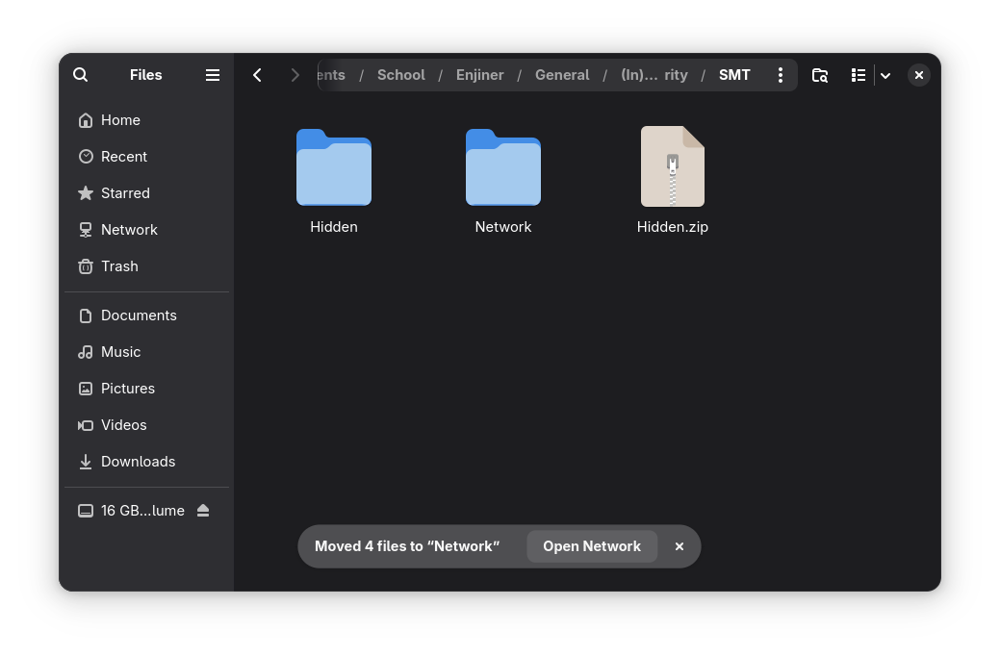

Inside the directory are various XML files, and inspecting one of them will reveal the flag.

```
.
├── Hidden
│   ├── [Content_Types].xml
│   ├── docProps
│   │   ├── app.xml
│   │   └── core.xml
│   ├── _rels
│   └── xl
│       ├── printerSettings
│       │   └── printerSettings1.bin
│       ├── _rels
│       │   └── workbook.xml.rels
│       ├── sharedStrings.xml
│       ├── styles.xml
│       ├── theme
│       │   └── theme1.xml
│       ├── workbook.xml
│       └── worksheets
│           ├── _rels
│           │   └── sheet1.xml.rels
│           └── sheet1.xml
```

Content of sharedStrings.xml:

```
<si>
<t>One-hour drive = 10 km + 50 patience points.</t>
</si>
<si>
<t>Online Shopping</t>
</si>
<si>
<t>"Cuma lihat-lihat" ends in checkout.</t>
</si>
<si>
<t>Public Holidays</t>
</si>
<si>
<t>1 real holiday + 3 "hari kejepit nasional."</t>
</si>
</sst>
<!--  SMT2025{could_be_anywhere_so_beware}  -->
```

Alternatively, you can use grep with the -r option to find the SMT pattern in the current directory (.) or other directories. The sharedStrings.xml is a structure to contain all string data of the Open Office format, so it's often used to hide data. 

### Scheduler Shenanigans

Description:

```
You've entered a compromised Linux box.
Something’s ticking every minute — and it’s not a clock. The adversary might drop something inside, something time-sensitive, and you need to inspect it.
Ironically, its familiarity is what makes it stealthy. 

Find the flag before it resets!!!
Connect here: nc 52.77.77.117 9000
```

Trying to inspect the shenanigans return something like this:

```
fred@fedora:~$ nc 52.77.77.117 9000
====================================
 Welcome to Scheduler Shenanigans!
====================================

Someone's been here before you...
A scheduler is running in the shadows.

Can you catch the beacon before it's gone?

Good luck, hacker!

14
ctfuser@9a07c6f2347b:/$ ls
ls
banner.txt  dev            etc       lib    libx32  opt   run   sys  var
bin         dropper.sh     flag.txt  lib32  media   proc  sbin  tmp
boot        entrypoint.sh  home      lib64  mnt     root  srv   usr
ctfuser@9a07c6f2347b:/$ cat flag.txt
cat flag.txt
cat: flag.txt: Permission denied
ctfuser@9a07c6f2347b:/$ cat dropper.sh
cat dropper.sh
#!/bin/bash
cp /flag.txt /tmp/flag
chmod 644 /tmp/flag
chown ctfuser:ctfuser /tmp/flag
sleep 10
rm /tmp/flag
ctfuser@9a07c6f2347b:/$
```

Seems like the dropper.sh is a script used to automate copying the flag.txt file to the tmp folder where the ctf user has access to read and write the file. However, it only stays there for only 10 seconds. Turns out the dropper command is scheduled to run every minute using crontab.

```
ctfuser@9a07c6f2347b:/$ cat /etc/crontab
cat /etc/crontab
# /etc/crontab: system-wide crontab
# Unlike any other crontab you don't have to run the `crontab'
# command to install the new version when you edit this file
# and files in /etc/cron.d. These files also have username fields,
# that none of the other crontabs do.

SHELL=/bin/sh
# You can also override PATH, but by default, newer versions inherit it from the environment
#PATH=/usr/local/sbin:/usr/local/bin:/sbin:/bin:/usr/sbin:/usr/bin

# Example of job definition:
# .---------------- minute (0 - 59)
# |  .------------- hour (0 - 23)
# |  |  .---------- day of month (1 - 31)
# |  |  |  .------- month (1 - 12) OR jan,feb,mar,apr ...
# |  |  |  |  .---- day of week (0 - 6) (Sunday=0 or 7) OR sun,mon,tue,wed,thu,fri,sat
# |  |  |  |  |
# *  *  *  *  * user-name command to be executed
17 *	* * *	root    cd / && run-parts --report /etc/cron.hourly
25 6	* * *	root	test -x /usr/sbin/anacron || ( cd / && run-parts --report /etc/cron.daily )
47 6	* * 7	root	test -x /usr/sbin/anacron || ( cd / && run-parts --report /etc/cron.weekly )
52 6	1 * *	root	test -x /usr/sbin/anacron || ( cd / && run-parts --report /etc/cron.monthly )
#
* * * * * root curl -s http://localhost:8000/dropper.sh | bash
```

Essentially what happened is the flag is only available for 10 seconds every minute. I think I got lucky first try because I get to cat the flag once and then when I try to recreate the solution to write this WU it doesn't work... However, there's an automation command to get the flag as soon as it's available:

```
ctfuser@9a07c6f2347b:/$ while true; do cat /tmp/flag 2>/dev/null && break; sleep 1; done
<o cat /tmp/flag 2>/dev/null && break; sleep 1; done
SMT2025{automated_persistence_daemon}
ctfuser@9a07c6f2347b:/$ 
```

```
while true {
	do cat /tmp/flag 2>/dev/null # redirect error to dev/null
	break # when the above command is successful, break out of the loop
	sleep 1 # wait for one second before retrying
}
```

## OSINT

### Place

Description

```
During a trip I visited a small but lovely European town. What is the name of the town?

Format: town name, all lowercase, wrapped in SMT2025{ ... }
Example: SMT2025{middlesbrough}
```


This is the image provided for the challenge. Doing a reverse image search will return an overview by Google that it's located in Regensberg, Switzerland. 


If you hate how AI is everywhere and wish it's not pushed down your throat this much (same tbh), don't worry, you can still solve this challenge without AI. On the Visual Match tab, you can find multiple images referencing the village of Regensberg.


Flag: SMT2025{regensberg}

### Online

Description

```
My friend found an interesting website online, but he hides the domain from me! Can you help me find it?

Format: domain wrapped in SMT2025{ ... }
Example: SMT2025{google.com}
```

Given this image:

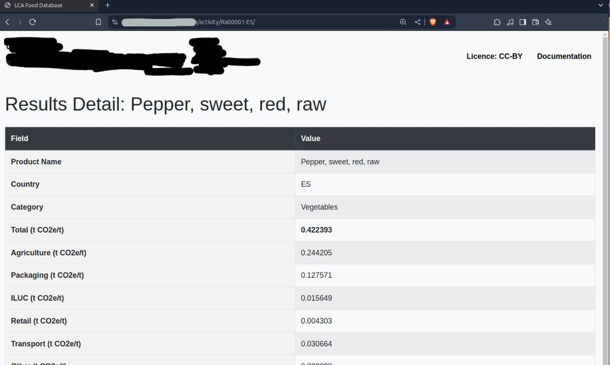

This is a perfect opportunity to flex your Google Dorking muscles. My strategy here is to find a website that contains any unique string inside the table (I use Product Name and the t CO23/t thing), and its title being "LCA Food Database". One of the queries can be something like this:

```
"Product Name" "t CO2e/t" intitle:"LCA Food Database"
```

Found the website that way, so flag: SMT2025{thebigclimatedatabase.com}

### The Beauty Of Arrakis

Description

```
A mysterious Ethereum whale has moved tens of thousands of ETH over the years. One day, they transferred a huge amount of ETH in a single transaction. Find the transaction hash!

Whale Wallet:
0x742d35Cc6634C0532925a3b844Bc454e4438f44e


Flag format: SMT2025{transactionhash}
```

This is where the challenges went 180 from your usual OSINT challenges to investigating cryptocurrency transaction. I search for a simple blockchain explorer and paste in the wallet address to find transaction history. This is how I found out that the wallet is mostly used for ETH (Ether) transactions and I should probably be using a dedicated scanner for the ETH blockchain for better and easier analysis.


I'm using [etherscan.io](https://etherscan.io/) to analyze the ETH wallet. They were NOT kidding about the whale status of this address. It's been used for years and it has thousands of transactions.

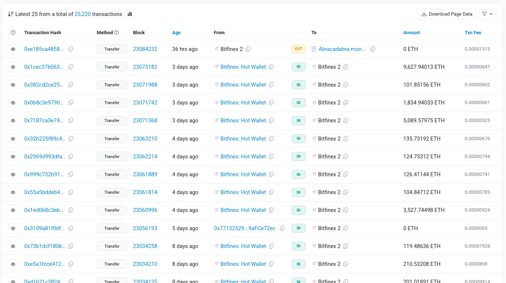

To solve this challenge in an efficient manner, you need to understand the key things you're asked to do: 

```
1. Wallet did a massive transfer (outgoing transcation) one day
2. Find the transcation hash of that transfer
```

We can filter for incoming/outgoing transaction, but it's still hard to scrape information because the wallet owner did a lot of incoming and outgoing transaction, both in massive amount of money. However, I noticed that the values of outgoing transactions are very small in comparison with incoming transactions. (I switched to [oklink.com](https://oklink.com/) because it has more intuitive filtering technique for a newbie in blockchain analysis like me):

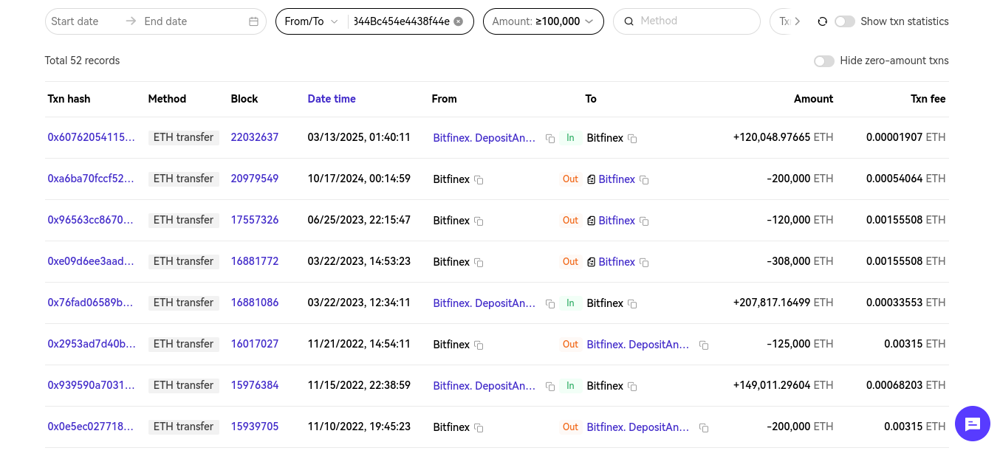

100,000 is just a lucky guess because it's a huge wallet so I suppose most of its transaction will exceed that. That's how I filter for "huge transfers." Filtering for only `From <address value>` will filter for outgoing transaction, which will filter the transaction history even further, making it easier for us to search manually.

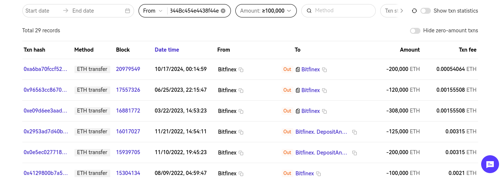

We got from 2K transactions, to 52, and then to only 29. At this point I found this particular [transaction.](https://www.oklink.com/ethereum/tx/0xc868d5bfd0ecf0492fecdb9bc897da0d20d8a3b19bc7843b1e1151349a6a5407)

Flag: SMT2025{0xc868d5bfd0ecf0492fecdb9bc897da0d20d8a3b19bc7843b1e1151349a6a5407}

### 007 - OREO

Description

```
Your agent in the field, known only as Mr. Oreo, has gone dark.

Before disappearing, he left behind a clue, a digital breadcrumb hidden in plain sight. According to a tip received by our intelligence team, Mr. Oreo minted an NFT on the Sepolia testnet (Ethereum) earlier this July. Somewhere in that token lies the flag, a vital piece of information that could compromise an entire operation.

Mr. Oreo's wallet:
0xEDFfD5AEc7f8f1b9E112DD12C04507359A578d47

No timestamp, no direct message, just this wallet and a trail of on-chain activity. Your mission is to investigate the wallet, identify any NFTs minted in July 2025, and recover the hidden flag.

Mr. Oreo trusted that only the sharpest eyes would find his message. Don’t let him down.
```

This might be intimidating for first timers, but the description really gave a lot of helpful hints. Let's break down the key things that help us:

```
1. Mr Oreo minted an NFT on Sepolio test net chain
2. The NFT was minted somewhere in July
```

Using etherscan to scan the Sepolio test net, supplying the address, and filtering for NFT we got this information about the wallet:

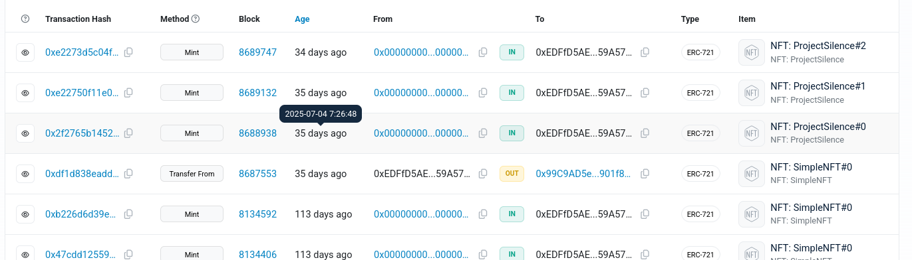

I searched everywhere, from the contract to its source code looking for a hint of a flag, but turns out the answer is on the transaction detail. 

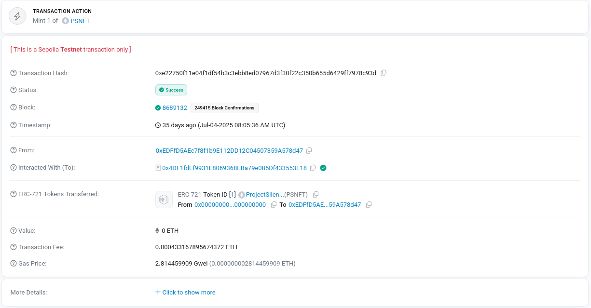

Clicking on more detail will reveal an ipfs link that has the Token URI:

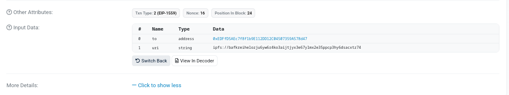

There were 3 minting processes on the transaction, all three with different URI's. The second transaction will return this interesting json:

```
{
  "name": "Mr. Oreo 007",
  "description": "Mr. Oreo — silent but clever.\nHey hacker, my CID: bafkreibwjrsqy36vy23typkpaaj4cf74dfwohhkgfqtadxljkffzf74ppm",
  "image": "ipfs://bafybeibdyrgco64euwzygkyikx4k7ucxgj3volgwi3qfn3vfumvvxocssy",
  "attributes": [
    {
      "trait_type": "Alias",
      "value": "Agent Oreo"
    },
    {
      "trait_type": "Mood",
      "value": "Infiltrative"
    },
    {
      "trait_type": "Background",
      "value": "Moonlight Shadows"
    },
    {
      "trait_type": "Gear",
      "value": "Night Vision"
    }
  ]
}

i visited this using ipfs.io/ipfs/<CID>
```

If you visit the CID, you will find:

```
{
    "Description": "Congratulations! Your flag: SMT2025{blockchain_is_cool}"
}
```

P.S Funny challenge, I solved this 10 minutes BEFORE it's due but whatever. 