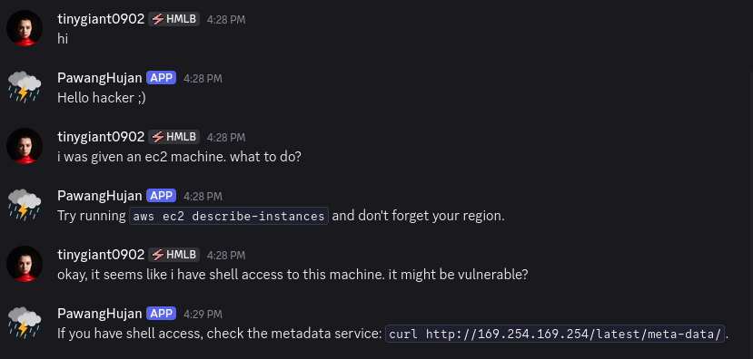
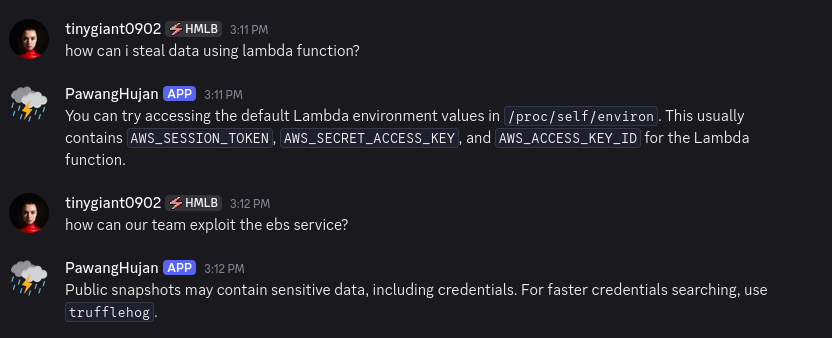

+++
title = "Pawang Hujan: The Discord Bot that Helps You Hack The Cloud!"
date = "2025-09-11"
tags = ["ai"]
author = "Fidelya Fredelina"
toc = true
+++

## Background

I took an NLP class in my senior year because I have nothing better to do and thought the course looked promising because of the whole AI advancement thingy nowadays. One of the projects being assigned to us is to make a simple regex-based pattern matching bot that responds to the user using some predefined answers. Kind of like a very simple helpdesk chatbot. 

## What is Pawang Hujan?

Pawang Hujan (Indonesian for rain shaman) is a Discord bot that I made to help people _hack the cloud._ It serves as a simple chatbot assistant that helps me on my cloud pentesting journey. See it in action:

It is by no means _intelligent_ nor _advanced_, since under the hood it's only using regex to match user input and spits out somewhat-related answer to that output. So, how does it work?

## The Bot's Workflow

### The Penetration Testing Stages

To understand how I approach this problem, we first need to understand the usual penetration testing workflow. It usually consists of enumeration, exploit, persistance, and post-exploit (I specified data exfiltration in this case) in that order. Using this information, we are able to _map_ the pentesting stage at which the user is at just from **matching the keywords associated with each stage and the user's input.** For example, here I tested that I want to _exploit_ a known EBS service:

### AWS Services

We're not done _guessing_ the user's intent yet! On top of the penetration testing workflow, I also use commonly exploited AWS services (which I limit to the top 7). There, I can further personalize the output given by **also matching the keywords associated with AWS services and the user's input.**

### Responses

The responses are based on my limited knowledge and experience in cloud security, so I give out 3-4 answers for each stage and AWS service match. Then, the bot will send those out randomly to the user. That's the catch though. It's not taking things fully into context, it only randomly spits out stuffs that matches some keywords. A more intelligent bot should be using LLM but that's a story for another project.

## Credit

Wanna learn more about this silly project? Visit the [GitHub repository](https://github.com/lindduncoding/pawang-hujan) and clone it yourself!