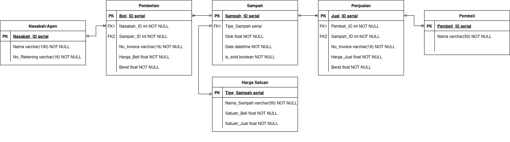
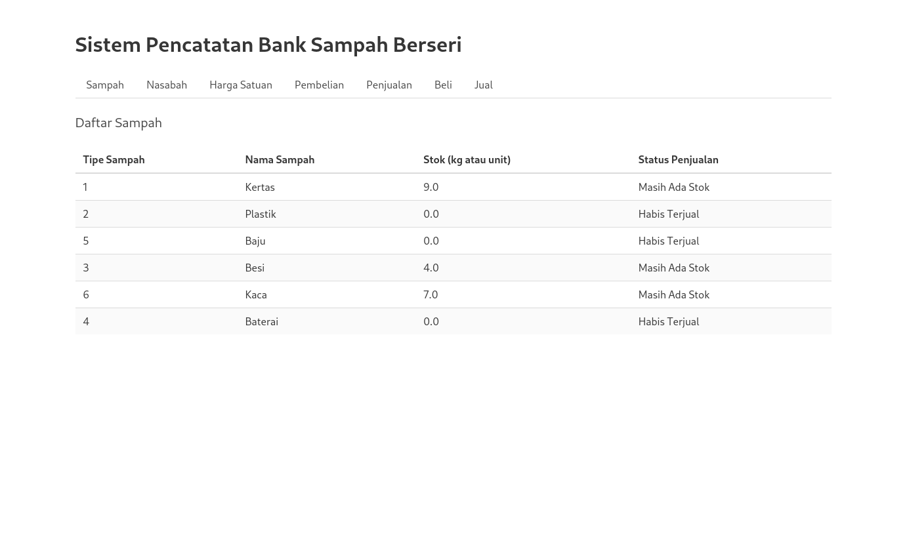

+++
title = "Database BSB: Full-stack Python Web-App for Bank Sampah Berseri"
date = "2025-07-11"
tags = ["backend"]
series = ["community-service"]
author = "Fidelya Fredelina"
toc = true
+++

## Welcome!

This is the first in the "Community Service" series. Don't worry, I didn't break any law. It's actually my university's program and one of the requirements to get a diploma. Basically you volunteer for 2 months in a remote-ish village all across Indonesia and do some stuffs. Since I'm the IT guy, I do the village's IT stuffs. One of them is this cool database I made for their _Bank Sampah_ (Waste Bank). 

## The Database Project

Why did I decide to make a database for a waste bank? The waste bank organizers were digitizing their waste inventory system. Their approach was to use Google Forms and Sheets. However, without proper schema for the data, it became a pain for them to sanitize and _correct_ the user inputs manually. They would need to input user and waste data manually, which also increase the chance of mistakes in the database. This is why I decided to make a custom-built web app instead of relying on managed services like Google Workplace, although it's much easier for the both of us. I also had 3-4 weeks to spare for this project alone so I thought it was doable, albeit too overkill for something like this. 

### Database Schema

So I went ahead and met with the organizers, collected their requirements and documented everything I'd need from them. After many hours of brainstorming, this is the schema I came out with:



Since data integrity is what I aimed to achieve, I use an RDBMS for this project. I opted for MariaDB (MySQL) because it's simpler than PostgreSQL. This design is centered around _sampah_ (waste), where traders could deposit their waste (in exchange of some cash provided by the waste bank) and buyrs could buy waste from the bank (providing the bank with cash as an incentive for the traders to trade in their waste). I tried to keep the schema as minimal as possible, so a waste item only has an ID, name, stock inside the inventory, and most importantly what _type_ it is. The type is tied to another entity that governs the _price_ of the waste. 

### Why Web App?

Other than that, traders have their own unique _bank account number_, which the web app will allow the organizers to just choose from the available lists of bank account numbers. The same logic is also true for buyers, although less strict because unlike traders, they don't really have an account number. The concept of this waste bank is everyone could just anonymously buy waste without needing an account. This way, the organizers don't need to manually type in user information. 

Another advantage of the system is the usage of file upload for the price entity. I allowed the organizers to maintain their price list separately (maybe using Excel or Spreadsheets) and then they can easily upload the newest price data to the web app, which then be used to update the actual values of price inside the MariaDB database. 

Because of this, I decided to use Python for my backend. Now before you scream at me asking why, it's because Python is mighty fine for data management, okay? I am aware that JS or other languages would allow me to upload a CSV file that will be used to update a table's entry. However, Python just makes it easier (and more familiar at least for me since it's a one man project) to use and develop because of their extensive data analysis/management submodules. Take a look at this, this is how I _upsert_ the CSV data using pandas Dataframe and sqlalchemy handles the database interaction:

```python
from sqlalchemy.orm import Session
from typing import List, Dict
from models.harga_satuan import HargaSatuan
import pandas as pd

def upload_harga(db: Session, df: pd.DataFrame):
    required_columns = {"nama_sampah", "satuan_beli", "satuan_jual"}
    if not required_columns.issubset(df.columns):
        raise ValueError(f"Kolom tidak sesuai: {required_columns}")

    # Upsert by nama_sampah
    for _, row in df.iterrows():
        nama_sampah = row["nama_sampah"].strip()
        satuan_beli = float(row["satuan_beli"])
        satuan_jual = float(row["satuan_jual"])

        harga = db.query(HargaSatuan).filter_by(nama_sampah=nama_sampah).first()
        if harga:
            harga.satuan_beli = satuan_beli
            harga.satuan_jual = satuan_jual
        else:
            new_harga = HargaSatuan(
                nama_sampah=nama_sampah,
                satuan_beli=satuan_beli,
                satuan_jual=satuan_jual
            )
            db.add(new_harga)

    db.commit()

def get_harga(db:Session)->List[Dict]:
    harga = db.query(HargaSatuan).all()
    return harga
```

The flow was simple for me to follow: treat the CSV as a dataframe object, iterate each row, treat the values as float, and update/insert new data. I use sqlalchemy to interact with the DB safely, pandas dataframe for the uploading CSV shenanigans, and Flask for the web app framework.

### The Dashboard

Now, like I said before, I'm not really someone keen on frontend development despite having years of experience as a designer. So, the resulting dashboard is this boring looking Excel-esque UI:



I use a templating engine Jinja for this project because everything was coded using Python anyway so might as well use another Python based framework. I wrote simple HTML codes (not even CSS), and use the provided user input to fill in the template. Securely, of course. I know how dangerous SSTI can be. 

## Reception

The organizers were really happy about how it all turned out. They felt it really helped them on the daily. They planned on presenting this project to the head of province or something like that but it never materalized. I was bumped but it's a whatever at best now. 

### Hosting

The challenging part was to actually host all of these services _securely_ (at least we tried). The budget for hosting such application for a year would be enormous and at that time we were dealing with the worst budget cuts of the university's history so I opted for a local hosting alternative. Luckily, a peer of mine from Internet Engineering had the amazing idea of deploying the web service into an old STB that runs a lightweight ARM-based Linux distribution. You could say that was my _first_ exposure to self hosting. 

### Out of Memory

Now the problem with using an unused and old STB as a self-hosting hardware even if it runs a lightweight Linux distribution is the fact that its hardware would not suffice for a prolonged web serving activity like this one. That, plus it also needs to act as a DATABASE server too. One of the most common problem with this setup is an _Out of Memory_ problem where the web app would suddenly be inaccessible because the STB is restarting itself. I have a dedicated troubleshooting step for this problem alone on my [GitHub repository Wiki.](https://github.com/lindduncoding/database-bsb/wiki/3%E2%80%90Masalah-Umum#masalah-system-load). _It's in Indonesian because it's intended for the waste bank organizers so, sorry about that lol._

## Verdict?

Was it all necessary for a village's waste bank? Probably not. Was it _fun_ and I learnt new things along the way? Absolutely, and I think that's what matters. Well, check out the repository if you want to [learn more.](https://github.com/lindduncoding/database-bsb/)